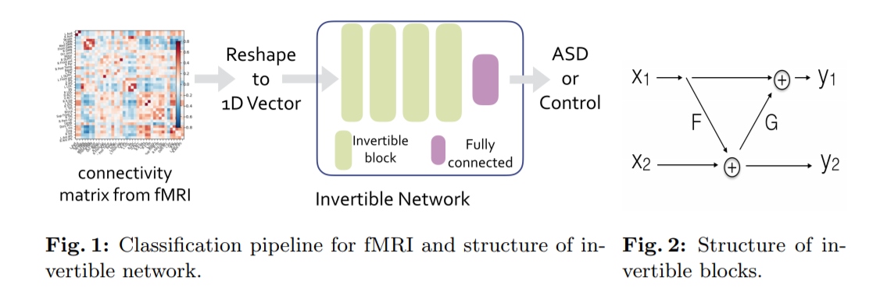

# Introduction
* This repo contains the code to reproduce the results on toy example for the paper [Invertible Network for Classification and
Biomarker Selection for ASD](https://arxiv.org/pdf/1907.09729.pdf)
* The basic idea is to use an invertible neural network, and explicitly determine the decision boundary.
* After determining the decision boundary, we can calculate the projection of a data point onto the decision boundary. <br/>
The difference between and point and its projection onto the boundary can be viewed as the explanation for network decision.

# Requirements
* PyTorch 0.4 or higher
* matplotlib
* tqdm

# How to run
* run ```python train_inverse_net_1d.py``` to train
* run ```python generate_boundary.py``` to generate figures

# Invertible block structure
<br/>

The forward and inverse of an invertible block is: <br/>
 <br/>

# Invertible Network as a 2-stage model
* transfrom from the input domain to the feature domain $feature = T(x)$ where $T$ is an invertible function
* linear classifier in the feature domain $\hat{y} = Linear\_Classifier(feature)$

# Results 
* We explicitly determine the decision boundary, and the projection of datapoints onto the boundary <br/>

